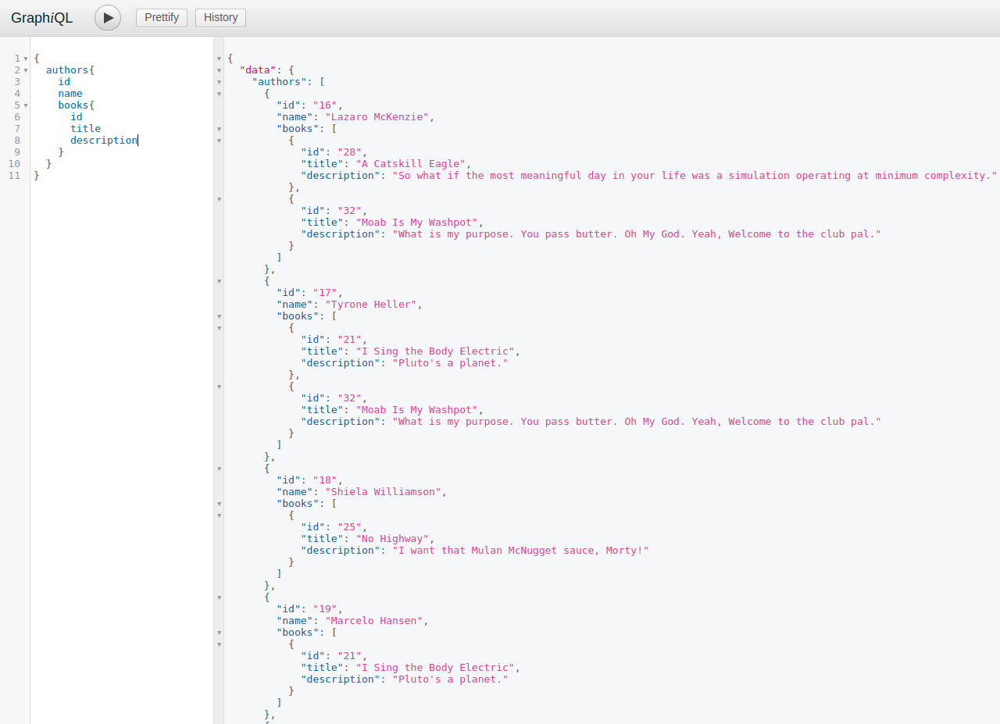
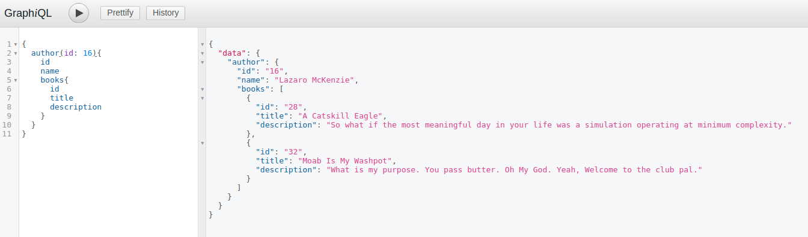
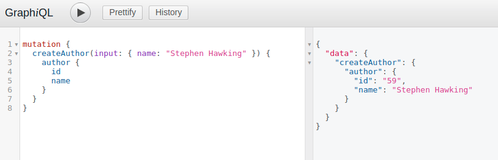
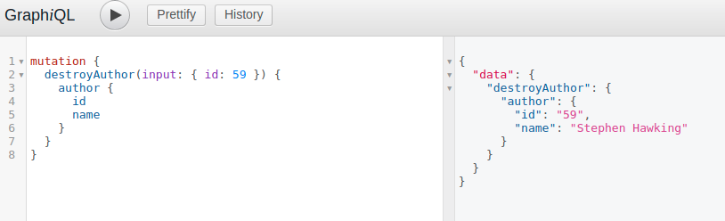
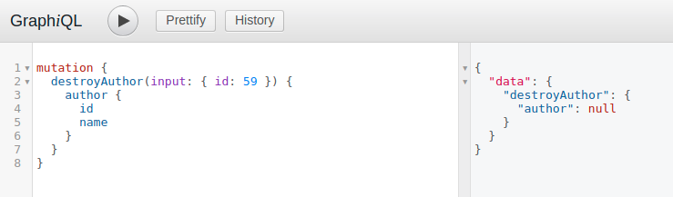

# Rest API vs Graphql-ruby
This is the base example of using REST and GraphQL API for your rails application.

This application is using the [`graphql-ruby` gem](https://github.com/rmosolgo/graphql-ruby)

* [Models](#models)
* [Getting all data](#getting-all-data)
* [Finding a record](#finding-a-record)
* [Creating a record](#createing-a-record)
* [Record deleting](#record-deleting)

## Models

This app has two models: `author` and `book`:

`app/models/author.rb`:
```ruby
class Author < ApplicationRecord

  validates :name, presence: true

  has_many :authorships, dependent: :destroy
  has_many :books, through: :authorships, dependent: :destroy

end
```

`app/models/book.rb`:
```ruby
class Book < ApplicationRecord

  validates :title, presence: true

  has_many :authorships, dependent: :nullify
  has_many :authors, through: :authorships

end
```
## Getting all data
### Rest API

`config/routes.rb`:
```ruby
namespace :api do
  namespace :v1 do
    resources :authors
  end
end
```

`app/controllers/api/v1/authors_controller.rb`:
```ruby
module Api

  module V1

    class AuthorsController < ApplicationController

      def index
        authors = Author.all
        render json: authors
      end
      
    end
    
  end
  
end
```
`app/serializers/author_serializer.rb`:
```ruby
class AuthorSerializer < ActiveModel::Serializer

  attributes :id, :name
  has_many :books, through: :authorships

end
```
Rest API request:

GET: `localhost:3000/api/v1/authors`:
```json
[
  {
    "id": 16,
    "name": "Lazaro McKenzie",
    "books": [
        {
            "id": 28,
            "title": "A Catskill Eagle",
            "description": "This sounds like something The One True Morty might say."
        },
        {
            "id": 32,
            "title": "Moab Is My Washpot",
            "description": "I don't get it and I don't need to."
        }
    ]
  },
  {
      "id": 17,
      "name": "Tyrone Heller",
      "books": [
          {
              "id": 21,
              "title": "I Sing the Body Electric",
              "description": "Pluto's a planet."
          },
          {
              "id": 32,
              "title": "Moab Is My Washpot",
              "description": "I don't get it and I don't need to."
          }
      ]
  },
    {
        "id": 18,
        "name": "Shiela Williamson",
        "books": [
            {
                "id": 25,
                "title": "No Highway",
                "description": "I want that Mulan McNugget sauce, Morty!"
            }
        ]
    }
]
```
### Graphql
Unlike the REST API GraphQL has only one endpoint:

`config/routes.rb`:
```ruby
post "/graphql", to: "graphql#execute"
```

`app/graphql/types/query_type.rb`:
```ruby
module Types

  class QueryType < Types::BaseObject

    field :authors, [Types::AuthorType], null: false

    def authors
      Author.all
    end

  end

end
```
GraphQL request:
<p align="center">
 
</p>

This is how you can execute the query in Ruby:
```ruby
query_string = "
  {
    authors {
      id
      name
      books {
        id
        title
        description
      }
    }
  }
"

RestGraphqlSchema.execute(query_string)
```

## Finding a record
### Rest API
`app/controllers/api/v1/authors_controller.rb`:

```ruby
def show
  render json: Author.find(params[:id])
end
```
Rest API request:

GET: `localhost:3000/api/v1/authors/16`:
```json
{
    "id": 16,
    "name": "Lazaro McKenzie",
    "books": [
        {
            "id": 28,
            "title": "A Catskill Eagle",
            "description": "This sounds like something The One True Morty might say."
        },
        {
            "id": 32,
            "title": "Moab Is My Washpot",
            "description": "I don't get it and I don't need to."
        }
    ]
}
```
### GraphQL
`app/graphql/types/query_type.rb`
```ruby
field :author, Types::AuthorType, null: true do
  argument :id, ID, required: true
end

def author(id:)
  Author.find_by(id: id)
end
```
Request:
<p align="center">
 
</p>

## Creating a record
### Rest API
`app/controllers/api/v1/authors_controller.rb`:
```ruby
def create
  author = Author.new(author_params)
  if author.save
    render json: author, status: :created
  else
    render json: author.errors, status: :unprocessable_entity
  end
end

private

def author_params
  params.require(:author).permit(:name)
end
```

Rest API request:

POST: `localhost:3000/api/v1/authors`:

Params: `author[name]: "Robert B. Parker"`
```json
{
    "id": 58,
    "name": "Robert B. Parker",
    "books": []
}
```

### GraphQL
`app/graphql/types/mutation_type.rb`:
```ruby
module Types

  class MutationType < Types::BaseObject

    field :create_author,  mutation: Mutations::AuthorMutations::CreateAuthor

  end

end
```
`app/graphql/mutations/author_mutations/create_author.rb`:
```ruby
module Mutations

  module AuthorMutations

    class CreateAuthor < Mutations::BaseMutation

      null true

      argument :name, String, required: true

      field :author, Types::AuthorType, null: true
      field :errors, [String], null: false

      def resolve(name:)
        author = Author.create(name: name)
        if author.present?
          # Successful creation, return the created object with no errors
          {
            author: author,
            errors: []
          }
        else
          # Failed save, return the errors to the client
          {
            author: nil,
            errors: author.errors.full_messages
          }
        end
      end

    end

  end

end

```
Request:
<p align="center">
 
</p>

## Record deleting
### Rest API
`app/controllers/api/v1/authors_controller.rb`:
```ruby
def destroy
  @author.destroy
end

private

def set_author
  @author = Author.find(params[:id])
end
```
DELETE: `localhost:3000/api/v1/authors/58`:

```
Status: 204 No Content
```

## GraphQL
`app/graphql/mutations/author_mutations/destroy_author.rb`:
```ruby
field :destroy_author, mutation: Mutations::AuthorMutations::DestroyAuthor
```
`app/graphql/mutations/author_mutations/destroy_author.rb`:
```ruby
module Mutations

  module AuthorMutations

    class DestroyAuthor < Mutations::BaseMutation

      null false

      argument :id, ID, 'the ID of the author to delete', required: true

      field :author, Types::AuthorType, null: true
      field :errors, [String], null: false

      def resolve(id:)
        author = Author.find_by(id: id)
        author&.destroy
        {
          author: author,
          errors: []
        }
      end

    end

  end

end
```
Request:
<p align="center">
 
</p>

If you try delete the same record again server will response with empty object:
<p align="center">
 
</p>

## Useful links
* [GraphQL or REST? What should I use?](https://dev.to/sadarshannaiynar/graphql-or-rest-what-should-i-use-38mj)
* [GraphQL guide](http://graphql-ruby.org/guides)
* [How to graphql tutorial](https://www.howtographql.com/graphql-ruby/1-getting-started/)

## License
Timebot is Copyright © 2015-2018 Codica. It is released under the [MIT License](https://opensource.org/licenses/MIT).

## About Codica

[](https://www.codica.com)

rest-graphql is maintained and funded by Codica. The names and logos for Codica are trademarks of Codica.

We love open source software! See [our other projects](https://github.com/codica2) or [hire us](https://www.codica.com/) to design, develop, and grow your product.

