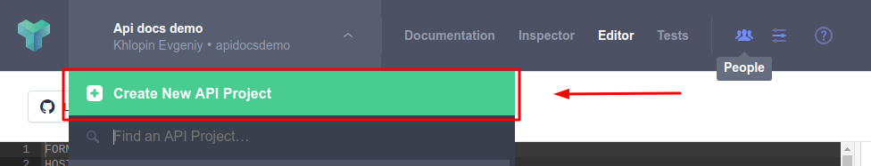

# API documentation  
This is the example of how to generate the API documentation in your rails app.  
  
This application is using the next gems:
* [Apipie](https://github.com/Apipie/apipie-rails)
* [Dox](https://github.com/infinum/dox)
* [Rspec api documentation](https://github.com/zipmark/rspec_api_documentation)

## APIPIE
Apipie-rails is a DSL and Rails engine for documenting your RESTful API. Instead of traditional use of `#comments`, Apipie lets you describe the code, through the code.

### Getting started
Add gem to your Gemfile
```ruby
# Gemfile
gem 'apipie-rails'
```
Install gem with `bundle install && rails g apipie:install`

### Usage
Describe allowed params and returned properties in the controller:
```ruby
# app/controllers/api/v1/books_controller.rb

module Api  
  module V1  
    class BooksController < ApplicationController

      def_param_group :book do
        param :id, :number, desc: 'Books id'	  
        param :book, Hash do
          param :title, String, required: true, desc: 'Books title', only_in: :requiest
          param :description, String, desc: 'Books description', only_in: :requiest 
        end

        property :title, String, desc: 'Books title'  
        property :descriprion, String, desc: 'Books description'  
        property :created_at, String, desc: 'Date of the book creation'  
        property :updated_at, String, desc: 'Last time the book was updated'
      end
      
    end	
  end
end
```

The next step is to describe the HTTP request for your controller actions. Here you can describe the HTTP methods, returned values,  response codes and required params:
```ruby
# app/controllers/api/v1/books_controller.rb
...
api :GET, '/books/', 'Shows all books'  
returns array_of: :book, code: 200, desc: 'All books'  

def index  
  books = Book.all  
  render json: books  
end

api :POST, '/books/', 'Create a new book'  
returns :book, code: 200, desc: 'Created book'  
param_group :book  

def create  
  book = Book.new(book_params)
  if book.save  
    render json: book, status: :ok  
  else  
    render json: book.errors, status: :unprocessable_entity  
  end  
end
```
Thats all! Now you can go to the [localhost:3000/apipie](http://localhost:3000/apipie) and check the generated api documentation.
<p align="center">  
	 
</p>
<p align="center">
	  
</p>

For more information please checkout [apipie gem documentation]([https://github.com/Apipie/apipie-rails#documentation)

## DOX
Dox generates API documentation from Rspec controller/request specs in a Rails application. It formats the tests output in the [API Blueprint](https://apiblueprint.org/) format.

### Getting started
Add this line into your Gemfile:
```ruby
group :test do
  gem 'dox', require: false
end
```
Run `bundle install`

Require Dox in the `rails_helper` and configure rspec:
```ruby
# spec/rails_helper.rb

require 'dox'

RSpec.configure do |config|
  config.after(:each, :dox) do |example|
    example.metadata[:request] = request
    example.metadata[:response] = response
  end
end
```
Then configure the Dox:
```ruby

# spec/rails_helper.rb

Dox.configure do |config|
  config.header_file_path = Rails.root.join('spec/docs/v1/descriptions/header.md')
  config.desc_folder_path = Rails.root.join('spec/docs/v1/descriptions')
  config.headers_whitelist = ['Accept', 'X-Auth-Token']
end
```

Run create `header.md` by running the command:
```bash
mkdir -p ~/spec/docs/v1/descriptions/ && echo "# [Your app name]" >> header.md
```
Load descriptions in the `rails_helper.rb`: 
```ruby
# spec/rails_helper.rb

Dir[Rails.root.join('spec/docs/**/*.rb')].each { |f| require f }
```

### Usage
Define a descriptor module for a resource using Dox DSL:
```ruby
# spec/docs/v1/books.rb
  
module Docs    
  module V1  
    module Books
      extend Dox::DSL::Syntax
      
      document :api do  
        resource 'Books' do  
          endpoint '/books'  
          group 'Books'  
        end  
      end

      document :index do  
        action 'Index'  
      end
    
      document :create do  
        action 'Create'  
      end

    end  
  end  
end
```

Include  the descriptor modules into your specs:
```ruby
# spec/request/api/v1/books_spec.rb

require 'rails_helper'  
  
RSpec.describe 'Book', type: :request do  
  include Docs::V1::Books::Api

  let!(:books) { create_list(:book, 10) }

  describe 'GET /books/' do  
    include Docs::V1::Books::Index
    it 'returns all books', :dox do
      get '/api/v1/books'
      expect(response).to be_successful
      expect(json.count).to eq(books.count)
    end
  end

  describe 'POST /books/' do  
    include Docs::V1::Books::Create  
    it 'creates a book', :dox do  
      post '/api/v1/books', params: valid_params  
      expect(response).to be_successful  
      expect(json).to have_key('id')  
      expect(books.count).to be < Book.count  
    end  
  end
end
```

To generate documentation run:
```bash
-f Dox::Formatter --order defined --tag dox --out public/api/docs/v1/apispec.md
```
The generated documentation path is `public/api/docs/v1/apispec.md` 
For more comfortable usage you can create a rake task with this command:
```ruby
# lib/tasks/api.rake

namespace :api do
  namespace :doc do
    desc 'Generate API documentation markdown'
    task :generate do
      require 'rspec/core/rake_task'

      RSpec::Core::RakeTask.new(:api_spec) do |t|
        t.pattern = 'spec/request/api/v1/'
        t.rspec_opts = "-f Dox::Formatter --order defined --tag dox --out public/api/docs/v1/apispec.md"
      end

      Rake::Task['api_spec'].invoke
    end
  end
end
```
Now the documentation can be generated by `rake api:doc:generate` command

### Renderers
You can render the HTML yourself with one of the renderers:

-   [Aglio](https://github.com/danielgtaylor/aglio)
-   [Snowboard](https://github.com/subosito/snowboard)

Both support multiple themes and template customization.
Or you can just take your generated markdown and host your documentation on  [Apiary.io](https://apiary.io/)

#### Apiary
To use apiary you have to install [apiary gem](https://github.com/apiaryio/apiary-client)
```ruby
# Gemfile

gem 'apiary-client'
```
Sign up on the  [apiary.io](https://apiary.io/) and get your token on API key on [this page](https://login.apiary.io/tokens)

Put your API key to the `.env`:
```
APIARY_API_KEY=<your_token>
```
Create new API project
<p align="center">
	  
</p>

Create new task to publish your api documentation:
```ruby
# lib/tasks/api.rake

namespace :api do
  namespace :doc do
    ...
    desc 'Publish API documentation to the apiary'
    task :publish do
      `apiary publish --path=public/api/docs/v1/apispec.md --api-name=apiary_api_project_name`
    end
  
  end
end
```

Now you have a well formatted documentation generated out of your specs to share with your team

<p align="center">
	  
</p>
<p align="center">
	  
</p>

More info about dox and apiary can be found here:
* [https://github.com/infinum/dox](https://github.com/infinum/dox)
* [https://github.com/apiaryio/apiary-client](https://github.com/apiaryio/apiary-client)

## Rspec api documentation

Gem [rspec_api_documentation](https://github.com/zipmark/rspec_api_documentation) generates API documentation from RSpec like the [dox gem](https://github.com/infinum/dox).

### Getting started

Add rspec_api_documentation to your Gemfile
```ruby
gem 'rspec_api_documentation'
```
Bundle it:
```bash
bundle install
```

### Usage
Set up specs
```bash
mkdir spec/acceptance && touch spec/acceptance/books_spec.rb
```

Fill your spec file file with some code:
```ruby
# spec/acceptance/books_spec.rb
require 'rails_helper'  
require 'rspec_api_documentation/dsl'  
  
resource 'Books' do  
  let!(:books) { create_list(:book, 10) }  
  
  get '/api/v1/books' do  
    example_request 'all books' do  
      expect(status).to eq(200)  
    end  
  end
   
  post '/api/v1/books' do  
    parameter :title, scope: :book  
    parameter :description, scope: :book  
    let(:title) { Faker::Book.title }  
    let(:description) { Faker::ChuckNorris.fact }  
  
    example_request 'create a book' do  
      expect(status).to eq(200)  
    end
  end  
end
```
Generate your documentation with:
```bash
rake docs:generate
```
Now you can find your documentation here `doc/api/index.html`

This is how it's looks like
<p align="center">  
	 
</p>
<p align="center">
	
</p>
<p align="center">
	  
</p>

More info about rspec_api_documentation you can find on [this page](https://github.com/zipmark/rspec_api_documentation)

## License  
Timebot is Copyright © 2015-2019 Codica. It is released under the [MIT License](https://opensource.org/licenses/MIT).  
  
## About Codica  
  
[](https://www.codica.com)  
  
Api documentation is maintained and funded by Codica. The names and logos for Codica are trademarks of Codica.  
  
We love open source software! See [our other projects](https://github.com/codica2) or [hire us](https://www.codica.com/) to design, develop, and grow your product.
